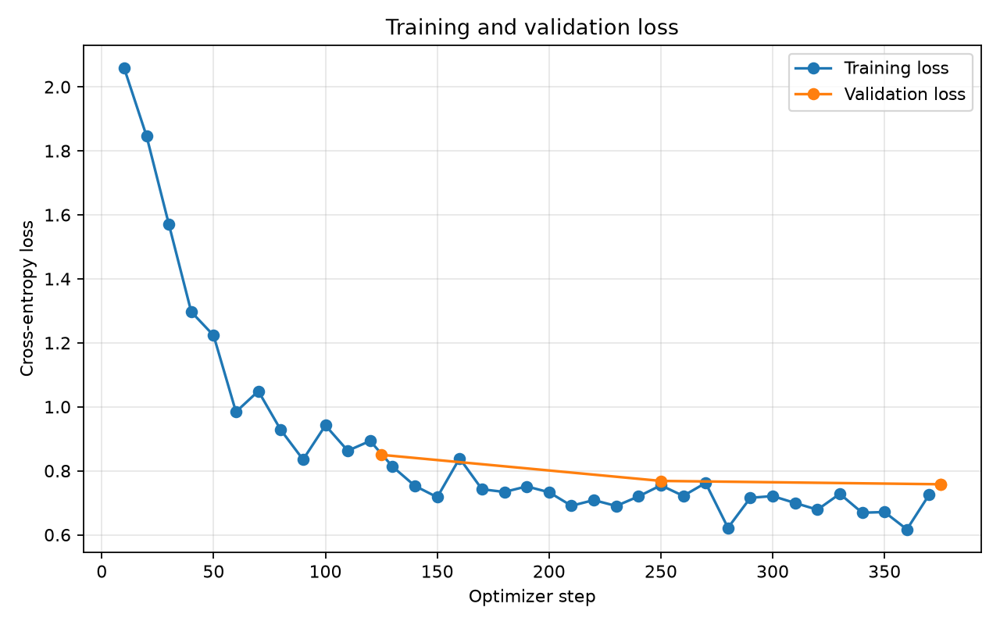

```text
  ______          __       __       ______            __             
 /_  __/__  _  __/ /_      \ \     / ____/_  ______  / /_  ___  _____
  / / / _ \| |/_/ __/  _____\ \   / /   / / / / __ \/ __ \/ _ \/ ___/
 / / /  __/>  </ /_   /_____/ /  / /___/ /_/ / /_/ / / / /  __/ /    
/_/  \___/_/|_|\__/        /_/   \____/\__, / .___/_/ /_/\___/_/     
                                      /____/_/                       
```

Text2Cypher: A reproducible CPU-based pipeline for fine-tuning
`HuggingFaceTB/SmolLM2-135M-Instruct` to generate Cypher queries from:

```text
graph schema + natural-language question → Cypher query
```

The repository includes supervised fine-tuning, deterministic generation, unit tests, smoke tests, per-sample evaluation, and baseline-versus-fine-tuned analysis.

| Resource         | Location                              |
| ---------------- | ------------------------------------- |
| Fine-tuned model | `oscardean/smollm2-135m-text2cypher`  |
| Dataset          | `RomanTeucher/text2cypher-curated`    |
| Base model       | `HuggingFaceTB/SmolLM2-135M-Instruct` |
| Python           | `3.11`                                |

Fine-tuned model can be found on Huggingface: `oscardean/smollm2-135m-text2cypher`

---

# 1 · Setup

## Recommended setup with uv

Install [uv](https://docs.astral.sh/uv/), clone the repository, change into the project directory, and install the locked environment:

```bash
git clone <REPOSITORY_URL>
cd text2cypher
uv sync --locked
```

This creates a project-local `.venv` and installs the exact dependency versions stored in `uv.lock`.

Commands can be executed without manually activating the virtual environment:

```bash
uv run python --version
```

## Alternative setup with pip

```bash
python -m venv .venv
source .venv/bin/activate
pip install -r requirements.txt
```

### Windows PowerShell

```powershell
python -m venv .venv
.venv\Scripts\Activate.ps1
pip install -r requirements.txt
```

The provided `.sh` scripts run on macOS, Linux, WSL, and Git Bash. Native Windows users can execute the corresponding `uv run python ...` commands shown below.

---

# 2 · Automated checks

## Unit tests

```bash
uv run pytest
```

The tests cover:

* dataset validation;
* prompt construction;
* response-only label masking;
* dynamic batch padding;
* Cypher normalization and canonicalization;
* evaluation metrics;
* result serialization.

## Linting

```bash
uv run ruff check .
```

Ruff checks the Python source for style problems, unused imports, and common implementation mistakes.

---

# 3 · Smoke tests

Smoke tests verify that the complete pipeline works on a very small subset. They are not intended to produce a useful model.

## Training smoke test

```bash
./scripts/train_smoke.sh
```

Temporary outputs are written to:

```text
outputs/smoke_checkpoints/
outputs/smoke_final_model/
outputs/smoke_training_history.json
outputs/smoke_training_loss.png
```

## Base-model evaluation smoke test

```bash
./scripts/evaluate_smoke.sh
```

## Fine-tuned smoke-model evaluation

```bash
./scripts/evaluate_smoke.sh \
  outputs/smoke_final_model \
  outputs/fine_tuned_smoke.json
```

---

# 4 · Full experiment

## Step A — Evaluate the base model

```bash
./scripts/evaluate_full.sh \
  HuggingFaceTB/SmolLM2-135M-Instruct \
  results/base_model_test.json
```

Equivalent direct command:

```bash
uv run python evaluate.py \
  --model-path HuggingFaceTB/SmolLM2-135M-Instruct \
  --split test \
  --output-path results/base_model_test.json \
  --num-threads 4
```

The base-model result file contains aggregate metrics and an individual result for every test sample.

## Step B — Fine-tune the model

```bash
./scripts/train_full.sh
```

The script keeps macOS awake during training when `caffeinate` is available. The screen may be locked or turned off, but the MacBook lid should normally remain open.

### Default training configuration

| Parameter               |  Value |
| ----------------------- | -----: |
| Epochs                  |      3 |
| Learning rate           | `5e-5` |
| Train batch size        |      2 |
| Gradient accumulation   |      4 |
| Effective batch size    |      8 |
| Validation batch size   |      2 |
| Weight decay            | `0.01` |
| Warmup ratio            | `0.05` |
| Maximum sequence length |    800 |
| CPU threads             |      4 |

Intermediate checkpoints are written to:

```text
checkpoints/
```

The checkpoint with the lowest validation loss is restored and saved to:

```text
artifacts/final_model/
```

Training history and the loss plot are written to:

```text
results/training_history.json
results/training_loss.png
```

## Step C — Evaluate the fine-tuned model

Using the local final model:

```bash
./scripts/evaluate_full.sh \
  artifacts/final_model \
  results/fine_tuned_model_test.json
```

Using the uploaded Hugging Face model:

```bash
./scripts/evaluate_full.sh \
  oscardean/smollm2-135m-text2cypher \
  results/fine_tuned_model_test.json
```

Equivalent direct command:

```bash
uv run python evaluate.py \
  --model-path artifacts/final_model \
  --split test \
  --output-path results/fine_tuned_model_test.json \
  --num-threads 4
```

---

# 5 · Results

## Training and validation loss



Training loss was logged periodically during optimization. Validation loss was measured at the end of every epoch, and the checkpoint with the lowest validation loss was selected as the final model.

## Base model versus fine-tuned model

| Metric                        | Base model | Fine-tuned model |   Delta |
| ----------------------------- | ---------: | ---------------: | ------: |
| Normalized exact match        |      0.00% |            0.00% |   0.00% |
| Basic query structure         |      2.00% |          100.00% | +98.00% |
| Token F1                      |     12.35% |           55.20% | +42.85% |
| Node-label agreement          |      0.00% |           58.00% | +58.00% |
| Component match rate          |     29.20% |           49.60% | +20.40% |


Fine-tuning produced a clear behavioral shift. The base model mostly generated explanatory prose or unrelated text, while the fine-tuned model produced Cypher-shaped output for every test sample.

The strongest improvements were:

* basic query structure: `2% → 100%`
* token F1: `12.44% → 55.18%`
* node-label agreement: `0% → 58%`
* component match rate: `28.40% → 50.80%`

However, both exact-match metrics remained at zero. The model therefore learned the expected output format and many local Cypher components more successfully than precise schema grounding and full query semantics.

Typical remaining errors include:

* hallucinated labels or relationship types;
* omitted filters or constants;
* incorrect relationship directions;
* repeated conditions;
* SQL-like operators that are not valid Cypher;
* correct query structure with incorrect entities or return fields.

The complete per-sample results and generated comparison report are available in:

```text
results/base_model_test.json
results/fine_tuned_model_test.json
results/model_comparison.md
```

---

# 6 · Evaluation output

Each evaluation file contains aggregate metrics and one detailed result for every test sample:

```json
{
  "model": "artifacts/final_model",
  "split": "test",
  "summary": {
    "num_samples": 50,
    "normalized_exact_match": 0.0,
    "canonicalized_exact_match": 0.0,
    "has_basic_query_structure": 1.0,
    "token_precision": 0.6263,
    "token_recall": 0.5357,
    "token_f1": 0.5518,
    "component_match_rate": 0.508
  },
  "samples": [
    {
      "instance_id": "...",
      "schema": "...",
      "question": "...",
      "ground_truth": "...",
      "prediction": "...",
      "normalized_exact_match": 0.0,
      "canonicalized_exact_match": 0.0,
      "has_basic_query_structure": 1.0,
      "token_f1": 0.0,
      "component_match_rate": 0.0
    }
  ]
}
```

The aggregate metrics show the overall improvement, while the per-sample entries make it possible to inspect:

* whether the model followed the supplied schema;
* which labels, properties, and relationships were correct;
* whether filters and return values were preserved;
* whether a high lexical-overlap score still corresponded to an incorrect query.

A separate Markdown comparison can be generated with:

```bash
./scripts/compare_results.sh
```

This creates:

```text
results/model_comparison.md
```

with a side-by-side metric table and selected base-model versus fine-tuned prediction examples.

---

# 7 · Metrics

## Normalized exact match

Compares prediction and reference after removing superficial differences:

* Markdown code fences;
* leading and trailing whitespace;
* repeated whitespace;
* an optional trailing semicolon.

It remains strict and may mark semantically equivalent queries as incorrect.

## Canonicalized exact match

Additionally replaces declared node and relationship variables with deterministic names based on declaration order.

For example:

```cypher
MATCH (person:Person)-[:DIRECTED]->(movie:Movie)
RETURN movie.title
```

and:

```cypher
MATCH (p:Person)-[:DIRECTED]->(m:Movie)
RETURN m.title
```

receive the same canonical variable representation.

This is a deterministic heuristic, not complete semantic-equivalence checking.

## Token-multiset precision, recall, and F1

These metrics measure lexical overlap while:

* preserving repeated token counts;
* ignoring token order.

They provide partial credit for structurally similar queries, but a high score does not guarantee valid or semantically correct Cypher.

## Structural and component diagnostics

The evaluation additionally checks whether prediction and reference agree on:

* basic `MATCH` and `RETURN` structure;
* node labels;
* relationship types;
* properties;
* relationship directions;
* comparison operators.

These are diagnostic metrics rather than proofs of correctness.

---

# 8 · Design decisions

## Supervised fine-tuning

The dataset provides direct input-output pairs:

```text
schema + question → target Cypher
```

Supervised fine-tuning is therefore the most direct adaptation method. Preference optimization and reinforcement learning were not used because the dataset does not provide preference pairs or reward signals.

## Full-model fine-tuning

The model has approximately 135 million parameters. Full-model fine-tuning keeps the implementation simple and avoids introducing adapter-specific dependencies.

## Native instruction template

Training and generation use the tokenizer's native chat template:

```text
system instruction
graph schema
natural-language question
assistant Cypher response
```

This preserves the conversation format expected by the instruction-tuned base model.

## Response-only training loss

Prompt tokens are assigned the label `-100`.

The cross-entropy loss therefore applies only to the assistant's Cypher response and not to the system prompt, schema, or natural-language question.

## Sequence length of 800

Inspection of all formatted training examples found a maximum sequence length below 800 tokens.

This limit covers the prepared dataset while avoiding unnecessary computation associated with a substantially larger context window.

## Dynamic padding

Examples are stored at their natural lengths. The custom collator pads only to the longest sequence in each batch.

Label padding uses `-100`, ensuring padded positions do not influence the loss.

## Deterministic generation

Evaluation uses greedy decoding:

```text
do_sample = false
num_beams = 1
```

This makes generation reproducible and is appropriate for structured query generation.

## Validation and checkpoint selection

Validation loss is calculated at the end of every epoch.

The checkpoint with the lowest validation loss is restored before the final model is saved.

## CPU execution and thread selection

Training and evaluation explicitly limit CPU thread usage.

The shell scripts use a conservative default:

```bash
THREAD_COUNT=4
```

This value is forwarded to:

```text
OMP_NUM_THREADS
MKL_NUM_THREADS
--num-threads
```

### Check available CPU threads on macOS

Logical CPU threads:

```bash
sysctl -n hw.logicalcpu
```

Physical CPU cores:

```bash
sysctl -n hw.physicalcpu
```

For additional Apple Silicon information:

```bash
sysctl -a | grep perflevel
```

### Check available CPU threads on Windows

PowerShell:

```powershell
(Get-CimInstance Win32_ComputerSystem).NumberOfLogicalProcessors
```

Physical cores:

```powershell
(Get-CimInstance Win32_Processor).NumberOfCores
```

Both values:

```powershell
Get-CimInstance Win32_Processor |
    Select-Object NumberOfCores, NumberOfLogicalProcessors
```

### Choosing a thread count

A conservative rule for laptop execution is:

```text
smoke tests:  2 threads
full runs:    4 threads
upper bound:  roughly half of the available logical processors
```

For example, on a system with 10 logical processors:

```bash
THREAD_COUNT=4
```

is a reasonable default.

Using more threads does not always improve performance. It may increase scheduling overhead, heat, fan noise, and power consumption. Benchmarking a small run is the most reliable way to choose a value.

The thread count can be changed directly in the shell scripts:

```bash
THREAD_COUNT=4
```

or passed to the Python scripts:

```bash
uv run python train.py --num-threads 4
```

and:

```bash
uv run python evaluate.py --num-threads 4
```


---

# 9 · Limitations

* Exact matching cannot recognize every semantically equivalent Cypher formulation.
* Variable canonicalization does not reorder predicates or rewrite equivalent clauses.
* Token F1 measures lexical overlap rather than executability.
* Component extraction is heuristic and is not a full Cypher parser.
* The dataset does not include populated graph databases.
* True semantic evaluation would require executing predicted and reference queries on representative graphs and comparing their returned results.
* A 135M-parameter model is expected to produce plausible but frequently incorrect Cypher.
* Hyperparameter exploration is intentionally limited to keep the experiment resource-conscious and reproducible.

---

# 10 · Model distribution

The final model is hosted on the Hugging Face Hub:

```text
oscardean/smollm2-135m-text2cypher
```

Model weights are not committed directly to this Git repository.

---

# 11 · Optional analysis utilities

### `scripts/analysis/inspect_data.py`

Prints chat formatting and sequence-length statistics.

```bash
uv run python scripts/analysis/inspect_data.py
```

### `scripts/analysis/inspect_tokenization.py`

Prints tokenized lengths, truncation coverage, and fully masked sample counts.

```bash
uv run python scripts/analysis/inspect_tokenization.py
```

### `scripts/analysis/compare_results.py`

Creates a Markdown comparison of the base and fine-tuned evaluations.

### `scripts/compare_results.sh`

Convenience wrapper for the comparison script.

```bash
./scripts/compare_results.sh
```

Output:

```text
results/model_comparison.md
```

---

# 12 · Repository structure

```text
.
├── train.py
├── evaluate.py
├── pyproject.toml
├── uv.lock
├── requirements.txt
├── scripts/
│   ├── train_smoke.sh
│   ├── train_full.sh
│   ├── evaluate_smoke.sh
│   ├── evaluate_full.sh
│   └── analysis/
├── src/
│   └── text2cypher/
├── tests/
├── results/
├── checkpoints/          # generated, ignored
├── artifacts/            # generated, ignored
└── outputs/              # generated, ignored
```
